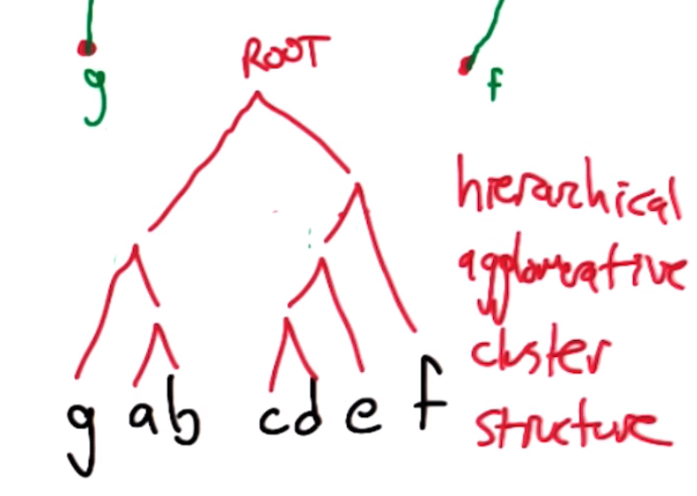
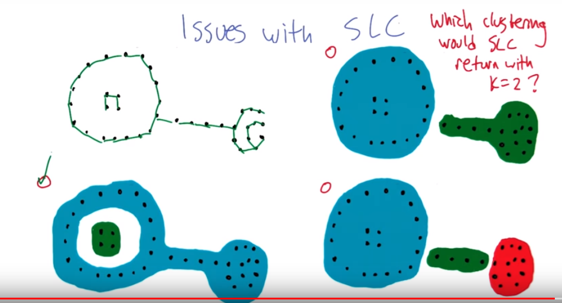
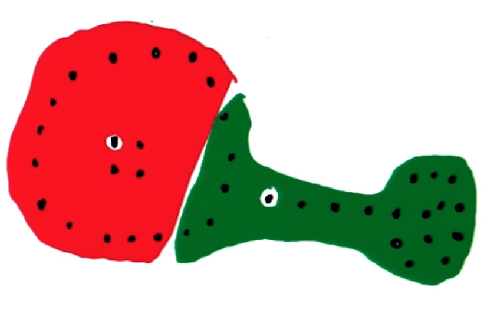
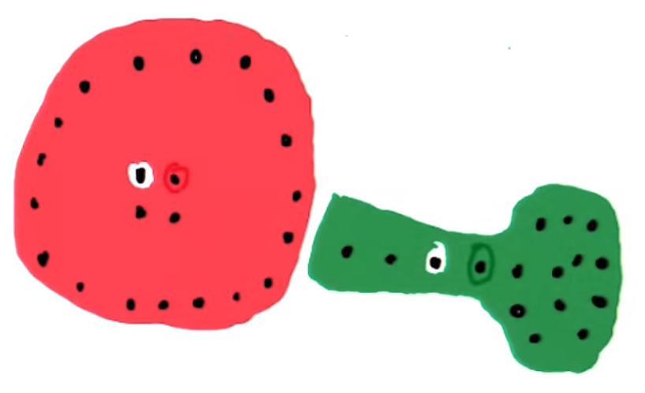

# Lesson 02: Clustering

## Unsupervised Learning

**Supervised Learning**: use labled data to generate labels to new instances. (function approximation)

**Unsupervised Learning**: Make sense of unlabeled data. (data description)

### Basic Clustering Problem

**Given**:

- Set of objects $X$
- inter-object distances: $D(x,y) = D(y,x)\text{ for } x,y \in X$
  - The similarity between objects, just like kNN. But it is where all things are based on.

**Output**:

- Partition $P_D(x)=P_D(y)$, if $x,y$ are in the same cluster.

2 trivial cases:

- Every instances belongs to a single cluster
- Each instance has its own cluster.

## Single Linkage Clustering (SLC)

Algorithm:

> - consider each object as a cluster ($n$ objects)
> - define the inter-cluster distance (as the distance between the closest two points in the two clusters).
> - merge two closest clusters.
> - repeat $n-k$ times to make k clusters.
> - consider instances in the same cluster as zero(though really you should only be thinking in concept of clusters, where instances are first 1:1 clusters then it doesn't matter)

By recording the links added, we can form a **hierarchical agglomerative clustering** (HAC) structure, which is a tree.
Tree represtation|
-|
|
The definition of the inter-cluster distance depends on domain knowledge and impacts on the effectiveness.

Advantages:

- Deterministic if no ties on distances.
- If SLC is on the length of the edges in a graph, then it is the same as the minimum spanning tree algorithm.
- The running time is friendly and can be characterized.
  - repeat $(n-k)$ times, each step calculate the distances between every pair two points, which is $O(n^2)$. So totally it's $O(n^3)$. But using some trick to store the distances, we can do better towards $O(n^2)$.

Issues:

- The SLC totally depends on the distances. So we may get the wrong clustering if the intermediate points in a cluster are missing.
- 
Bad dataset for SLC |
-|
|

Deviations:

- **Complete** linkage clustering: the inter-cluster distance is defined as the distance between the farthest points of two clusters.
- **Average** linkage clustering: the inter-cluster distance is defined as average distance between each point in one cluster to every point in the other cluster

## K-Means Clustering

Iterative algorithm:

> - Pick k centers (at random)
> - Each center claims its closest points.
> - Re-compute the centers by averaging the clustered points.
> - Repeat until convergence.

Example
First Step | Second->third
-|-
 | 

Center is not necessarilly a point in the cluster of instances btw (above can be misleading)

Questions:

- Does it converge?
- Does it do something good?

### K-Means in Euclidean space

$P^t(x)$: partition/cluster of object $x$ at step $t$.

$C_i^t$: set of all points in cluster $i$ = $\{x \; s.t. \; P^t(x) = i\}$

$center_i^t$: $=\sum_{y \in C_i^t} y / |C_i^t|$. (aka centroid)

Iterative process:

$$center_i^0$$
$$\Rightarrow P^t(x) = \underset{i}{argmin} ||x-center_i^{t-1}||_2^2 \quad (1)$$
$$\underset{t=t+1}{\Leftrightarrow} center_i^t\text{ :}=\sum_{y \in C_i^t} y / |C_i^t| \quad (2)$$

### K-means as optimization Problem

- Configurations: $center$, $P$
- Scores (errors): $E(P,center)=\sum_x ||center_{P(x)} - x||_2^2$
  - Defined as the sum of deviations from the center of each points.
- Neighborhood: $P, center = \{center', P\} \bigcup \{center, P'\}$
  - Changing either one element of the configuration.

K-means is just running the **hill climbing** using the above settings.

**Thus**, we can notice that, in both equation $(1)$ and $(2)$, the value of error function can never go up, and thus the error function becomes a monotonically non-decreasing function in the progress of k-means.

### Properties of k-Means

- Each iteration - polynomial time: $O(kn)$.
- **Finite** (exponential) possible configurations: $O(k^n)$ (but in practice, very low).
- Error decreases (if ties are broken consistently)
- Can get stuck - When meeting a local optima.
  - random restarts
  - Get initial centers spread out.
- K-means guarantees to converge, but there may be multiple local and global optime, so it is not deterministic.
- If centers are clustered themselves, it can lead to misleading clusters (See quiz #12)
  - Solutions are solved by the local optima answers(random restarts)

### Soft Clustering

Assume the data was generated by:

1. select one of k Gaussians (fixed known variance $\sigma^2$) uniformly.
2. sample $x_i$ from that Gaussian.
3. Repeat n times.

Task: Find a hypothesis about k means $h=<\mu_1,...,\mu_k>$ that maximizes the probability of given data (ML: Maximize Likelihood).

### Maximum Likelihood Gaussian

The ML mean of the Gaussian $\mu$ is the mean of the data.

What if there are k of Gaussian? -> Using hidden variables.

$$<x, z_1, ..,, z_k>$$

($z$ are the indicating variables about the cluster the data belongs to.)

## Expectation Maximization

$$
E[Z_{i,j}] = \frac{P(x=x_i|\mu=\mu_i)}{\sum_{j=1}^{k}P(x=x_i|\mu=\mu_j)}
\underset{\mu}{\overset{Z}{\rightleftharpoons}}
\mu_j = \frac{\sum_i E[Z_{i,j}]x_i}{\sum_i E[Z_{i,j}]}
$$

- $Z_{i,i}$ is the likelihood that the data point $i$ comes from the cluster $j$.
- The left part **Expectation** is the Beyes rule with the prior $P(\mu=\mu_{i/j})$ omitted.
- The right part **Maximization** gets the weighted average (centroids) from the datapoints.
- The $P(x=x_i|\mu=\mu_i)$ obeys Gaussian distribution.
- It will becomes exactly k-means if we assign cluster using argmax.

### Properties of EM

- Monotonically non-decreasing likelihood
- Does not converge (practically does).
  - Because in the probability space, there are infinite number of configurations. So the result can get closer and closer to the best result but may never be able to reach there.
- Will not diverge.
- Can get stuck in local optima.
  - random restart
- Can work with different probability distribution. (if E and M are solvable). For example, the Bayes net stuff.
- Small matter of mathematical algorithm derivation!

## Clustering Properties

**Richness**: For any assignment of objects to clusters, there is some distance matrix $D$ such that $P_D$ returns that clustering.

$$\forall C \; \exists D \;s.t. \;P_D=C$$

- the opposite is that there is a certain clustering that cannot be returned by the algorithm with any distance functions.
- This property is regardless of the distance matrix.

**Scale-invariance**: Scaling distances by a positive value should not change the clustering.

$$\forall D \; \forall k>0, \; P_D = P_{kD} $$

**Consistency**: Shrinking the intra-clustering distances or expanding the inter-cluster distances should not change the clustering.

$$P_D = P_{D'}$$

### Clustering Properties Quiz

| SLC stops when                                                                   | richness | scale-invariance | consistentcy |
| -------------------------------------------------------------------------------- | -------- | ---------------- | ------------ |
| $n/2$ clusters reached                                                           | N        | Y                | Y            |
| clusters are $\theta$ unit apart                                                 | Y        | N                | Y            |
| clusters are $\theta/\omega$ unit apart where $\omega=\underset{i,j}{max}D(i,j)$ | Y        | Y                | N            |

Note:

- The first one is not rich because it only can provide $C$ that has $n/2$ clusters (fixed number of clusters means it cannot represent all clusters).
  - For scale invariance, it only cares about order
  - For same reason of scale, it is consistent
- Scale, can multiple by theta to make it n clusters and divide by theta means 1
- The third one is not consistent because if we expand distance between 2 clusters so that the $\omega$ increase (to infinity), this will prevent the original clusters to merge.

### Impossibility Theorem (_Kleinberg_)

No clustering algorithm can all three of these:

- Richness
- Scale-invariance
- consistentcy

How bad it is?

- can you have 2.9?  Review kleinberg's paper for more info (redefining terms a bit)
- Unlikely to be able to completely automate but can do to get to know your data better

## Summary

- Clustering: the idea
- Connection to compact description
- Algorithms:
  - k-means
  - SLC (terminates faster)
  - EM (soft clustering)
- clustering properties and impossibility theorem

...
