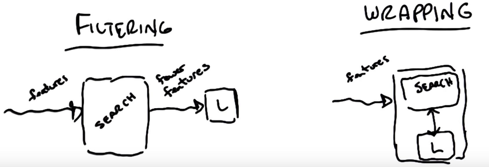
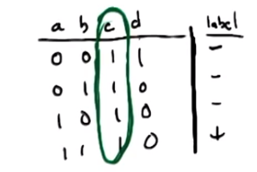
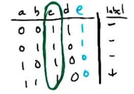

# Lesson 03: Feature Selection

## Motivations

Select the features that matter.

* Knowledge dicovery: interpretability(can really help understand data) + insight
* Curse of dimensionality,

## Feature selection algorithm

Given $n$ features, select $m$ of them.

### How hard is this?

It takes $2^n$ trials of the selection of the features. Exponential in time and it is actually a NP-hard problem.

> To go from n columns to m using a function for score

Note assumes don't know m.

### Filtering

Apply feature selection first and then pass them to the learning algorithm.

* Single forward, no feedback.
* The criterion is built in the selection, not from the learning algorithm.
* Run faster, but the price is that the features tend to be examined in isolation ignoring the learning itself.

*Decision tree* is an example of filtering (using *information gain*).  Boosting doesn't truly do this as it is filtering by samples.

Actually we can run decision tree algorithm in the filtering phase, and select the attributes appearing in the decision tree as the features. And then pass the selected to another learning algorithm. Use the inductive bias of dicision tree to select features and use the inductive bias of the other learning algorithm to do the learning.

For example, data -> DT -> kNN, can relief the curse of dimensionality to some extent.  You might do this if it has problems with say noise with DT.

Select criteria (domain knowledge):

* information gain
* variance, entropy
* "useful" features
* independent/non-redundant features

### Wrapping

feature selection and learning are done iteratively and update each other.

* feedback
* The criterion is from learning.
* It takes into account the bias of the learner, but it's much much slower.

Search algorithms on the feature selection:

* hill climbing
* randomized Optimization
* forward search: start with no attributes, add one feature if improving at a time.
* backward search: start with all attributes, remove one if improving at a time.

## Relevance

 quiz example | updated
 -|-
 | 
 a and b are strongly relevant | a and e are weakly relevant (e is opposite a)

c and d are irrelevant in both; c is relevant in contrived perceptron example.

Feature $x_i$ is **strongly relevant** if removing it from the *whole set of features*, it degrades the performance of BOC (Bayes Optimal Classifiers, here it means the best we can do).

Feature $x_i$ is **weakly relevant** if:

* Not strongly relevant
* There exists a subset $S$ such that adding $x_i$ to $S$ improves BOC.

$x_i$ is otherwise **irrelevant**.

For example, if one feature $x_1$ is totally dependent on another feature $x_2$ (e.g. $x_1=cx_2$), then these 2 features are not strongly relevant because if we remove one of them, we can still use another one to make decision. But they may be weakly relevant if they decide the label someway.

## Relevance vs Usefulness

**Relevance** measures the effect on BOC

* It's about the information

**Usefulness** measures effect on a particular predictor.

* It's about reducing the error given the model/learner.
* Think variable c and helping the origin limited perceptron $w^T > 0$
  * Can't use a bias unit like  $w^T + b > 0$, so c acts as b in practice (contrived, but for simplicity)

## Summary

* Feature Selection
* Filtering vs Wrapping
  * filtering is faster(?), ignores bias
  * Wrapping is slow but useful.
* Relevance vs usefulness
  * strong and weak relevance. (usefulness to BOC)
  * useful are specific to learners and success
