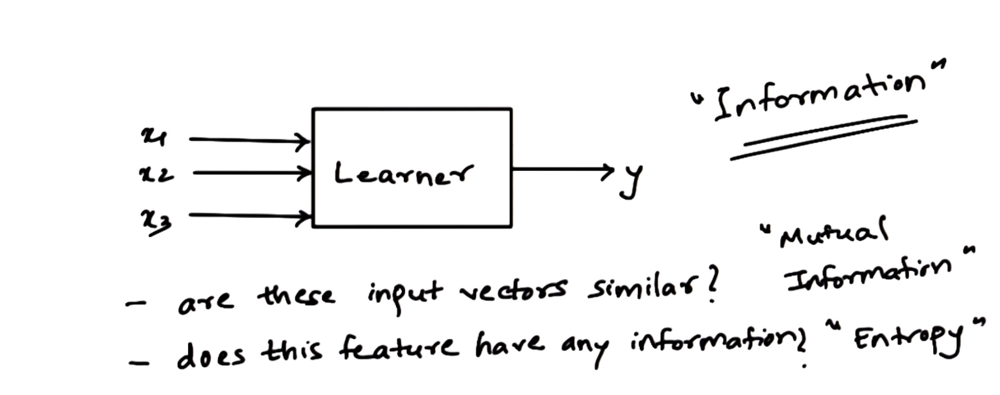
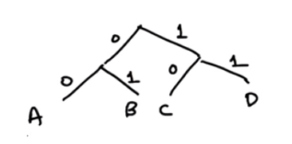
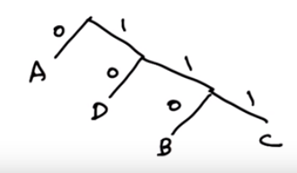
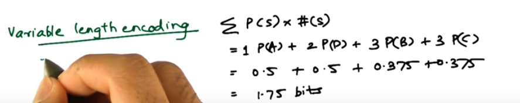
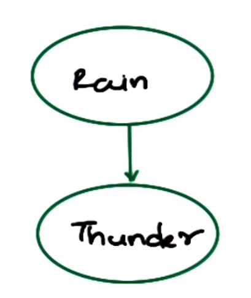

# Lesson 05: Information Theory

**NOTE**:  $\log$ is assumed $\log_2$

In machine learning context, in general, every input or output vector can be considered as a probability density functions. And thus information theory is a mathematical frame work that allows us to compare these density functions.

| What is info theory with ML              |
| ---------------------------------------- |
|  |

- Mutual information: How similar are these vectors?
- Entropy: Does the vector has any information?

## History

Claude Shannon - Came up with information theory in Bell labs. Trying to define things like how to charge with messages.

Maxwell's Demon - Thought experiment, energy can be converted into energy and then energy and information cannot be destroyed.

## Sending a message quiz

Fair coin -> 10 bits (have to know each flip)

Unfair(always heads) -> 0 bits (Don't need it sent)

This measure is entropy. (Ignore robust compression for this though experiment)

Shannon said entropy is the number of yes/no questions to get info.

## Sending a new Message

Which message has more information?

| Symbol | bit rep | occurence | New bit rep | New Occur |
| ------ | ------- | --------- | ----------- | --------- |
| A      | 00      | 25%       | 0           | 50%       |
| B      | 01      | 25%       | 110         | 12.5%     |
| C      | 10      | 25%       | 111         | 12.5%     |
| D      | 11      | 25%       | 10          | 25%       |

| Naive represent as a tree        | Represented as variable tree                  |
| -------------------------------- | --------------------------------------------- |
|  |  |

Saves bits overall

## Expected size of new message

What is the expected message size in the configuration above?

Depends on frequency of A,B,C and D

Morse code as example, it is a variable length encoding.

| Variable length encoding example        |
| --------------------------------------- |
|  |

Number of bits per symbol called entropy here.

## Entropy - generalized from example

Example: variable length encoding

$$ENTROPY = \sum P(s)*N(s) = \sum P(s)\text{log}\frac{1}{P(s)} = -\sum P(s)\text{logP}(s)$$

P(s) is probability of the character to occur.

N(S) is the length of the character encoding in bits.

## Information Between two variables

| Is there thunder? Hard to say.     | |
| ---------------------------------- |------
| What if you know if there is rain? |  |

### Joint entropy

It is the randomness contained in two variables together.

$$H(X,Y) = -\sum_{X,Y} P(X,Y) \text{log}P(X,Y)$$

### Conditional entropy

It measures the randomness of one variable given the other variable.

$$\begin{aligned}
H(Y|X) & = -\sum_{X,Y} P(X,Y) \text{log} P(Y|X)\\
& = \sum_X P(X)\;(-\sum_Y P(Y|X) \text{log} P(Y|X))
\end{aligned}$$

If $X$ is independent of $Y$, then:

$$H(Y(X)) = H(Y)$$

Meaning if $X$ gives no info on $Y$ then it's just the normal probability for $Y$

So the Joint entroy when indepent is then:

$$H(X,Y) = H(X) + H(Y)$$

## Mutual information

$H(Y|X)$ will be small whether $X$ tells very little about $Y$ or $H(Y)$ it self is very small.

$$I(X,Y) = H(Y) - H(Y|X)$$

Mutual information measures the reduction of randomness of a variable given knowledge of another variable.

**NOTE**:  Refer to Dr. Isbell's notes for more info.

## Quiz Two Independent coins

$$\begin{aligned}
    P(A) = P(B) = 0.5 && \text{Each coins chance}\\
    P(A,B) = 0.25&&\text{That both are heads, joint probability}\\
    P(A|B) = 0.5&&\text{Probability of A given B}\\
     && \text{ Independent so just P(A)}\\
     \\
     && \text{Entropy of each:}\\
    H(A) = 1 && H(A) = -\sum P(A) \log P(A)\\
    H(B) = 1 &&      = -0.5 \log 0.5 - 0.5 \log 0.5 = 1\\
    \\
    H(A,B) = 2 &&\text{Joint Entropy:}\\
     && H(A,B) = -\sum P(A,B) \log P(A,B)\\
     && H(A,B) = -4 (0.25 *  \log 0.25) = 2\\

    H(A|B) =1 &&\text{Conditional Entropy of A given B}\\
     && H(A|B) = -\sum P(A,B) \log P(A|B)\\
     && H(A|B) = -4 (0.25 *  \log 0.5) = 1\\
    \\

    I(A,B) = 0 &&\text{Mutal information between A and B}\\
     && I(A,B) = H(A) - H(A|B) = 1-1 = 0

\end{aligned}
$$

Please take note of the fairly obvious outcomes with the equations as a trivial answer.  

Remember to think of entropy as the number of bits required to represent the data.  That is the intuition for the equations.  Since A and B are independent you will always need 2 bits!  So joint entropy is 2!  The conditional is the same as each respective coins entropy because they are indepent!

It serves as a good linkage between terms, formulas and intuition that should make recall easier.

## Quiz Two Dependent coins

$A$ is always the same as $B$, so full ingformation

$$\begin{aligned}
    P(A) = P(B) = 0.5 && \text{Each coins chance}\\
    P(A,B) = 0.5&&\text{That both are heads, joint probability}\\
     &&\text{Same as individual chance}\\
     \\
    P(A|B) = 1 &&\text{Probability of A given B}\\
     && \text{ Dependent so just 1}\\
     \\
     && \text{Entropy of each(same):}\\
    H(A) = 1 && H(A) = -\sum P(A) \log P(A)\\
    H(B) = 1 &&      = -0.5 \log 0.5 - 0.5 \log 0.5 = 1\\
    \\
    H(A,B) = 1 &&\text{Joint Entropy:}\\
     && H(A,B) = -\sum P(A,B) \log P(A,B)\\
     && H(A,B) = -2 (0.5 *  \log 0.5) = 1\\

    H(A|B) =0 &&\text{Conditional Entropy of A given B}\\
     && H(A|B) = -\sum P(A,B) \log P(A|B)\\
     && H(A|B) = -2 (0.5 *  \log 1) = 0\\
    \\

    I(A,B) = 1 &&\text{Mutal information between A and B}\\
     && I(A,B) = H(A) - H(A|B) = 1-0 =1

\end{aligned}
$$

Please take note of the fairly obvious outcomes with the equations as a trivial answer.

Remember to think of entropy as the number of bits required to represent the data.  That is the intuition for the equations.  Since A and B are dependent you need 1 bit, because if you know one, then you know the other!  So the joint entropy is 1!  Also, the conditional is zero because if you know what one coin is, you know what the other which joint is assuming A given B

It serves as a good linkage between terms, formulas and intuition that should make recall easier.

## Kullback-Leibler Divergence (DK Divergence)

Measures the different between any two distributions.

$$D(p||q) = \int p(x) \text{log} \frac{p(x)}{q(x)}$$

Is alway non-zero and zero only when $p=q$. Serves as distance measure but does not obey triangle law. Can substitute the least square measure for fitting.

Usually in supervised learning we're trying to model to a particular distribution.

Just a different way to try to fit your data to an existing model.

## Conclusion

This is just a primer.  For more info references

[Charles Isbell's note on Info Theory](https://github.com/pushkar/4641/raw/master/downloads/InfoTheory.fm.pdf)

[An introduction to info theory and entropy](https://github.com/pushkar/4641/raw/master/downloads/gentle_intro_to_information_theory.pdf)

...
