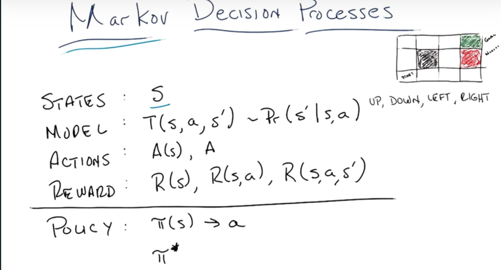

# Lesson 01: Markov Decision Processes

## Decision Making + Reinforcement Learning

Supervised learning: $y=f(x)$. function approximator

Unsupervised learning: $f(x)$. clusters description

Reinforcement learning: $y=f(x), z$. given $x$ and $z$, find $f$ that generates $y$

https://www.jair.org/index.php/jair/article/view/10166/24110

Michael's paper

## Markov Decision Processes

The world, just a 2D map.

Deterministic vs stochastic

Markovian property only the present matters.

stationary rules don't change

stationary preferences

doesn't works needs a change ...

when all the rewords are positive + infinite

utility Vs Reward

long term vs immediate

utility is reward plus total reward down the road

this is the bellman equation

Policy iteration next

....
