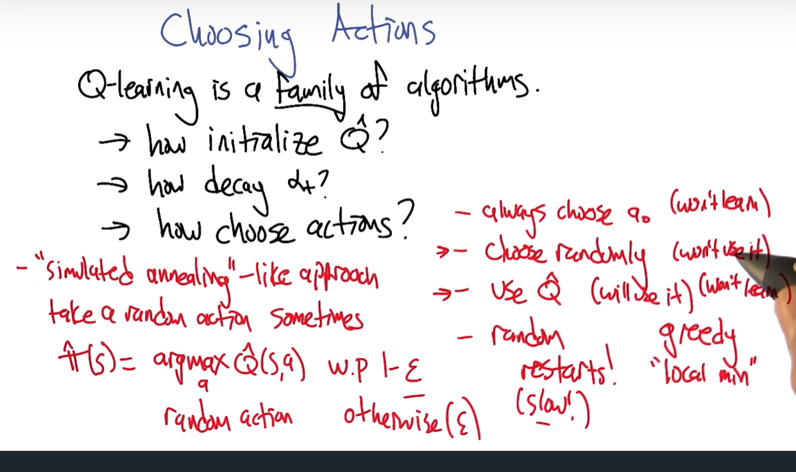

# Notes on RL lecture

Random extensive link:  https://towardsdatascience.com/the-complete-reinforcement-learning-dictionary-e16230b7d24e

## RL

Think of RL "API"

Model(T,R) -> Planner -> policy ($\pi$)    *Planning*

Transitions (S,a,r,s',s*) -> Learner -> policy     *Reinforcement Learning*

Andrew moore slides:
http://www.autonlab.org/tutorials/gametheory.html

http://www.autonlab.org/tutorials/nonzerosum.html

## Rat Dinosaurs

Strengthen as repetition.  See below:

RL is more of reward maximization, RL in phsychology is very different.

We are kind using it wrong until now and now same.

## API

### Quiz

Model-based RL vs Model free?

Modeler is like supervised learningx

One of the most successful RL-based planner options was backgammon (is this the TD one?)

## Three approachs to RL

### Policy search

S -> $\pi$ -> a

* direct use of indirect learning
* Temporal credit assignment problem

### Utility

S -> U -> v

* Value function based
* Need to turn it into a policy
  * usually done with argmax
  * Some indirectness but ok

### Model based

Transition matrix/function/model

s,a->T,R->s',r

* model based
* Value iteration to solve bellman equations (somewhat heavy)
  * Value function based approaches
* Fairly direct learning
* Is kind of supervised learning
* Direct learning, indirect use

Value/Utility approaches are remarkably powerful for their simplicity

## A new Kind of value function

$$

U(s) = R(s) + \gamma \max_a \sum_{s'} T(s,a,s')U(s') \\

\pi(s) = \argmax_a \sum_{s'} T(s,a,s') \max_{a'}U(s')\\

$$

Recursive and non linear but can use `value iteration` to solve it

For review, the policy equation is take all actions and the weighted probability of the value function of each

Now a new one, the `Q function` q was available for naming
$$
Q(s,a) = R(s) + \gamma \sum_{s'} T(s,a,s') \max_{a'}Q(s',a')
$$
Value for arriving in a state s, leave with action, then proceeding optimally thereafter (almost like a lookahead)

That's the 3 terms/parts of the eq

## Value function quiz

U(s) returns a scalar and $\pi(s)$ returns action

How to do this if no model?  (Hint this is `Qlearning`)

$$

U(s) = \max_a Q(s,a) \\
\pi(s) = \argmax_a Q(s,a) \\

$$

## Q learningthe quiz

It's about evaluating bellman equations from data, by getting transitions from observations?

hint:  This is littered with queue, cue, cue puns

## Estimating Q from transitions

Don't have R and T matrices!

poly if you have them with value/policy iteration, but we don't

Take a transition/observation:

$<s,a,r,s'>$

$$
\hat{Q}(s,a) \leftarrow^\alpha r + \gamma \max_{a'}\hat{Q}(s'a') \\
\\
\\
\hat{Q}(s,a) \text{ is the estimate} \\

\alpha \text{ is the learning rate} \\
\gamma \max_{a'}\hat{Q} \text{ utility of next state} \\

\text{ the right half of this represents the utility of the state}\\

\text{note about dr littman's notation:}\\
V\leftarrow^\alpha X \text{ Equivalent to } V\leftarrow (1-\alpha)V + \alpha X

$$

## Learning incrementally

has to converge because of decay

Computes the average in the limit

See infinite samples 

Order doesn't matter, has to converge to mean

## Estimating Q from transitions two

## Q learning convergence

1 line of code!

only true if visit s,a infinitely often (problematic)

## choosing actions

Random Restarts? Already takes a long time.

utilize it ExploreExploit

## Epsilon greedy Explore

Explore Exploit Explain 

Fundamental tradeoff in RLFundamental tradeoff in RL

## Summer

http://www.cs.cmu.edu/afs/cs/project/jair/pub/volume4/kaelbling96a.pdf

