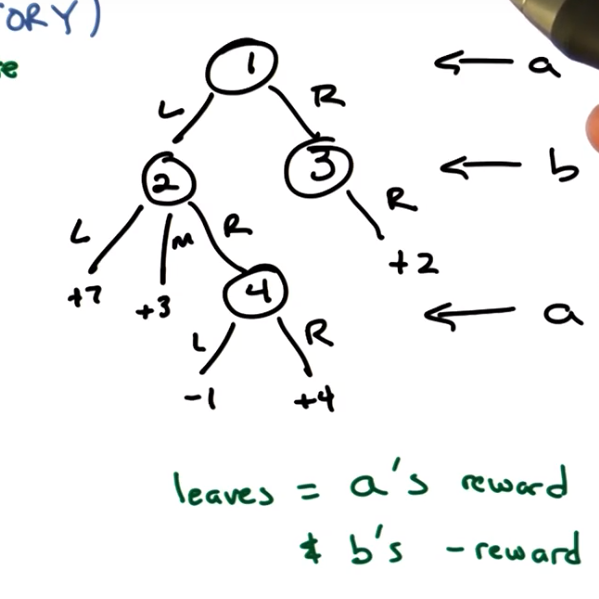

# Lesson 03: Game Theory

## What is Game Theory

It's the mathematics of conflict of interest when trying to make optimal choices.

> A theory used to model the mathematics of conflict and collaboration between multiple rational decision­‐makers

* Mathematics of conflict.
* Single agents -> multiple agents.
* Economics (and politics).
  * Biology
  * sociology
  * genes/cells? (intention may be missing, built into GT so may break down)
  * How do you incorporate conflicting intentions
* Increasingly a part of AI/ML.

## A Simple Game (Theory)

2-player zero-sum deterministic game of perfect information.

**Zero sum**: The total rewards to the players are summed to a constant (not necessarily to 0).

**Strategies**: A mapping of all possible states to actions. One strategy for each player.

**Pure Strategy**: The optimal action to take in every state in a game with perfect information.  (MDP not POMDP)

## Minimax

**Strategy matrix**

Matrix form of the game; how you got here does not matter.  once you have it in this type of game it's only thing that matters

*A must consider the worst-case counter strategy by B:* A is trying to maximize the minimum value A can get, where the minimum value comes from the strategy that B selects after A. (**Maxmini**)

*And B must consider the worst-case counter strategy by A.* B is trying to minimize the maximum value A can get, where the maximum value comes form the strategy that A selects after B. (**Minimax**)

In the above case, the strategy for A will end at the second row and that for B will end at the second column. The value of the game becomes 3.  (If A and B try to do the rational thing)

### Fundamental Result

In a 2-player zero-sum deterministic game of perfect information. Minimax = Maxmini, and there always exists an **optimal pure strategy** for each player.  (Pure strategy because it is deterministic and perfect info)

* Assumption: agents are rational. They are always trying to maximize their rewards and assuming everyone else is doing the same thing and assuming that everyone else is assuming the the same thing.

## Game Tree (relaxes deterministic req)

2-player zero-sum **non-deterministic** game of perfect information.

The expectations are calculated constructing the matrix. And the strategy doesn't care about the stochasticity of original game tree. One the matrix is fixed, the strategies are done.

You don't need the game tree, but you also can't reconstruct the tree from the matrix.

### Von Neumann's minimax theorem

The theorem that there always exists an optimal pure strategy for each player still holds here. (https://en.wikipedia.org/wiki/Minimax_theorem)

Note this includes deterministic and non-deterministic.

## Minipoker (relaxes perfect info)

2-player zero-sum (non-)deterministic game of **hidden** information.

The player B will not know which state he is in (one of two in the blue cricle).

From A perspective (Maxmini), B will resign if A resigns (-5) and will see if A holds (-5). So A will hold (or resign), and the value becomes -5.

From B perspective (Minimax), A will hold if B resigns (+10) and will resign if B sees (+5). So B will see, and the value will becomes +5.

So, in this case, Minimax $\neq$ Maxmini. A strategy need to depend on B and B strategy need to depend on A.

**Note**: The key difference here is that B does not know what A has chosen, and thus it only has 2 options which does not depend on the current state (because it does not know). Otherwise, B will know the state he is in (L or R) and have 4 actions: (L resign, R resign), (L resign, R see), (L see, R resign), (L resign, R resign).

## Mixed Strategies (opposite to pure)

Pure Strategy: always one strategy.

Mixed Strategy: distribution of strategies. Then the profit becomes a function of the probability.

### Center Game

The $P$ is the probability of A choosing to be a holder. Then there are two lines telling the expected rewards for A when B chooses to be a resigner or a seer.

* The intersection of two lines is $P=0.4$, where value for A is +1.
* If B also chooses mixed strategy, then the whole scissor region between 2 lines is the possible outcome space.
* $P=0.4$ is the maxmini for A. At this point, no matter what B does (or always trying to minimize A's rewards), the expected value A can get is always 1.
* The two lines can both have negative or positive slope, but the we can still find the maxmini. (far left, far right or the interection)
* This situation also holds for more than 2 players.

## Snitch

2-player **non-zero-sum** (non-)deterministic game of hidden information.

#### Prisoner's Dilemma

Value (A, B) | B coop | B defect
-------------|--------|---------
A coop       | -1, -1 | -9, 0
C defect     | 0, -9  | -6, -6

In order for B to maximize his value, if A defects, B should defect to save 1 month, and if A coop, B should also defect to save 3 months. This is also the case for A. **They will both defect**.

And thus they miss the situation where the total loss is minimum but heading towards where the total loss is maximum.

## A Beautiful Equilibrium

Given $n$ players with their strategy sets $S_1, S_2, ... ,S_n$. A set of strategy $S^*_1\in S_1, S^*_2\in S_2, ... ,S^*_n\in S_n$ is a **nash equilibrium** (N.E.) iff:
$$\forall i \quad S^*_i=\underset{S_i}{argmax}\; \text{utility}_i (S^*_1, S^*_2, ..., S_i, ... ,S^*_n)$$

In other words, for every player, the current strategy is the best one if all other players don't change their strategy.

* This equilibrium works for both the pure and mixed strategy. For mixed version: every player is going to choose a strategy distribution.

For the **Prisoner's Dilemma**, the Nash Equilibrium is that both defect.

* The second row is always better than the first one -> the second row **strictly dominates** the first row.
* We may be able to use this strictly domination to elimenate the row/column, and get the final result. In this case, the first row and the first column are elimenated.

#### Fundamental Theorems from Nash Equilibrium

1. In the n-player pure strategy game, if elimination of strictly dominated strategies eliminates all but one combination, that combination is the unique N.E.
2. Any N.E. will survive the elimination of strictly dominated strategies.
3. if n is finite, and all set of strategies are finite, there always exists (possibly mixed) N.E.

## The 2 Steps

What if the game is not played once, but played many times and the information of the previous games can be used in the following ones.

We always assume that every player chooses the best strategy for himself.

If A and B can build trust along the games, at the time of final game, it is a perfect timing for them to betray. (Since both of them thought the trust has been built.)

You can back propagate if there is a known end, because no future consequences in the final game, will mean all will be the nash eq.

#### Theorem

When there are n repeated games, there will be n repeated N.E.

* How to choose among multiple N.E.'s is not covered in this course.
* When when to end is not known, the things will be different.

## Summary

* Game Theory is Depressing
* We can Change the Game to get out the Dilemma.
  + Mechism Design: inverse game Theory, where the goal is to set the rewards in the game to let players choose the desired actions.
* We are in matrix.
  * Matrix is all we need
* Type of the game:
  + deterministic, non-deterministic
  + perfect, hidden information
  + zero-sum, non-zero-sum
* Strategies
  + pure, mixed
* Minimax
* Prisoner's Dilemma
* **Andrew Moore**
  * https://www.cs.cmu.edu/~./awm/tutorials/gametheory02.pdf
  * https://www.cs.cmu.edu/~./awm/tutorials/nonzerosum06.pdf
* Nash
